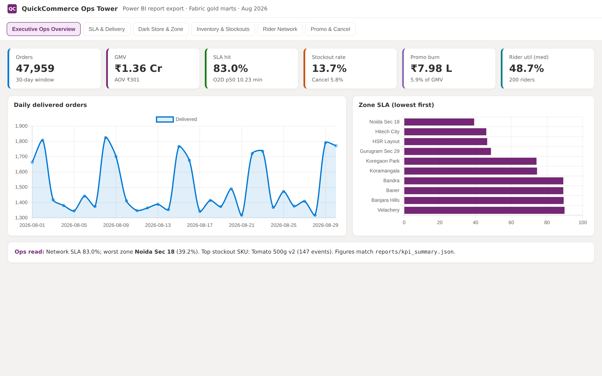
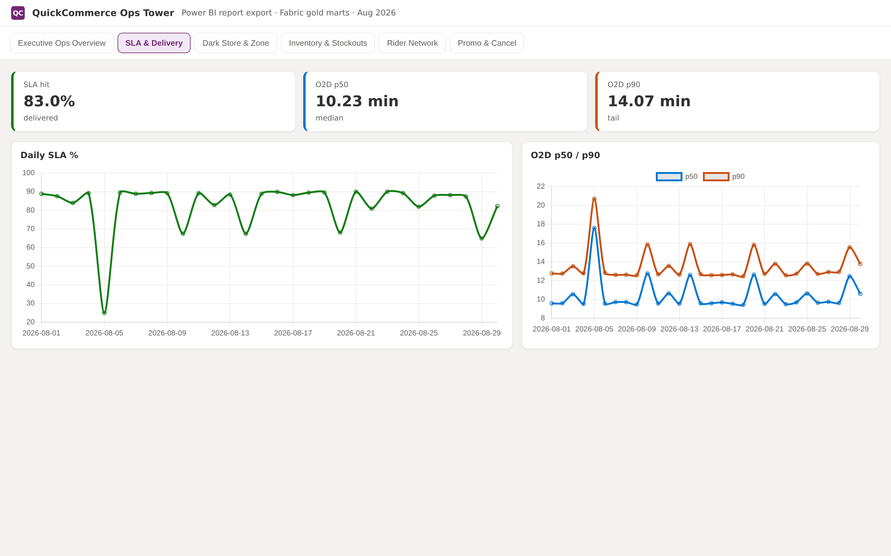
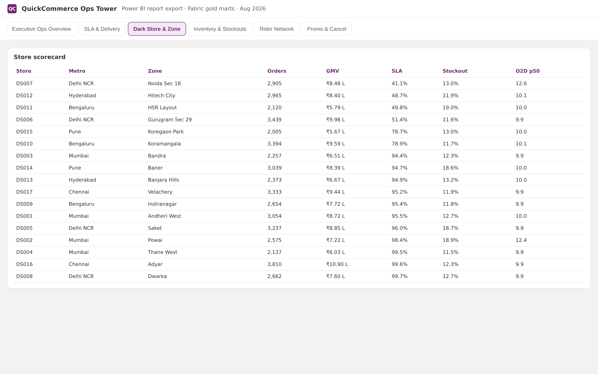
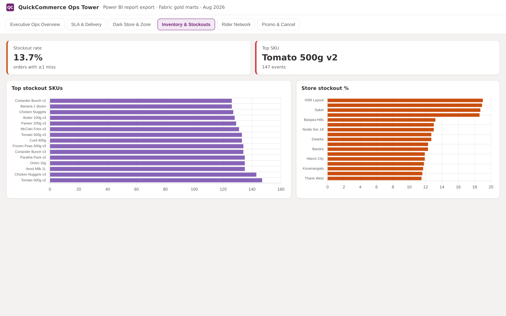
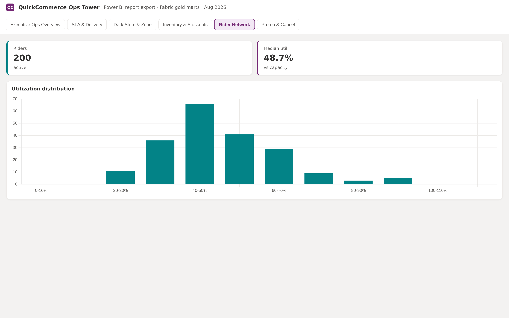
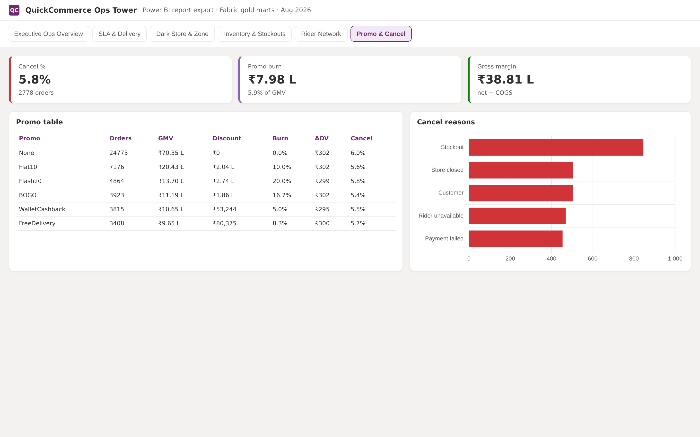

# QuickCommerce Ops Tower

Analysis of a quick-commerce dark-store network in India. Orders, delivery SLA, stockouts, riders, and promotions are reviewed together so ops teams can see where performance is slipping and what to investigate first.

**Walkthrough:** [`artifacts/quickcommerce-ops-demo.mp4`](./artifacts/quickcommerce-ops-demo.mp4)

---

## Business Problem

Dark-store teams often look at orders, inventory, delivery, riders, and promotions in separate files. That makes it hard to answer one practical question: *where are operations breaking down, and what should we check first?*

Typical issues:

- Order, stockout, and rider data sit at different levels and are hard to compare
- SLA discussions mix promise time with raw delivery time
- Stockouts show up inside partials and cancellations, so teams use different numbers
- Promo spend is tracked alone, not against cancellations or order value

---

## Dashboard Overview

A six-page interactive dashboard for network and store-level review. Decision-makers can move from overall KPIs to zone performance, stockout SKUs, rider utilization, and promo / cancel leakage in one place.

Period covered: **1 Aug 2025 – 30 Aug 2025** · 17 dark stores · 80 SKUs · 200 riders

---

## Key Metrics

| KPI | Value |
|---|---|
| Orders | **47,959** |
| Delivered | **45,181** |
| GMV | **₹1.36 Cr** |
| AOV | **₹300.94** |
| O2D p50 / p90 | **10.23 / 14.07 min** |
| SLA hit rate | **83.0%** |
| Stockout rate | **13.7%** |
| Cancellation rate | **5.8%** |
| Promo burn | **₹7.98 L** (5.9% of GMV) |
| Median rider utilization | **48.7%** |

Hot spots: weakest SLA zone **Noida Sec 18** (39.2%) · highest stockout SKU **Tomato 500g v2** (147 events)

---

## Dashboard Pages

### Executive Ops Overview



- Network recorded **47,959** orders and **₹1.36 Cr** GMV, with SLA at **83.0%**.
- Delivered volume (**45,181**) and AOV (**₹300.94**) set the commercial baseline.
- Overall health hides concentration risk — a few zones sit well below the network average.

### SLA & Delivery Performance



- Delivered order-to-door time is **p50 10.23 / p90 14.07 min**; the slower tail drives most SLA misses.
- **Noida Sec 18** hits only **39.2%** SLA versus **83%** network-wide.
- Evening slots and wet-weather days show higher promise risk than the daily average.

### Dark Store & Zone Heat



- Problems cluster by zone and store across the 17 dark stores, not evenly.
- Sorting by weak SLA and high stockouts helps teams decide where to look first.
- Useful for comparing metro pockets without rebuilding separate extracts.

### Inventory & Stockouts



- **13.7%** of orders have at least one stockout miss.
- **Tomato 500g v2** leads with **147** events; stockouts sit in a small set of fresh items.
- Fixing the top failing SKUs matters more than adding buffer across all 80 SKUs.

### Rider Network



- Median rider utilization is **48.7%**, so some stores still have capacity headroom.
- Weak-SLA zones need better dispatch and coaching, not only more riders.
- Vehicle mix and coaching lists help separate staffing gaps from utilization issues.

### Promo & Cancellation Leakage



- Promo discounts are about **5.9% of GMV** (**₹7.98 L** on delivered orders).
- Cancellation rate is **5.8%**, with a visible link to stockouts.
- Discount-led promos should be reviewed separately from fee-waiver offers.

---

## Key Findings

1. Network numbers look relatively healthy; the real issues sit in specific zones, stores, SKUs, and time windows.
2. SLA risk is sharpest in zones like Noida Sec 18, especially evenings and wet weather.
3. Stockouts are concentrated — a few SKUs drive many misses and feed cancellations.
4. Promo spend (~5.9% of GMV) needs offer-level review before scaling.
5. Rider capacity exists in parts of the network; weak zones need process fixes, not only more roster.

---

## Analysis Process

- Collected and cleaned source data.
- Validated KPI definitions.
- Performed exploratory analysis on orders, SLA, and inventory.
- Investigated zone, store, SKU, and rider patterns.
- Calculated business metrics used in the dashboard.
- Built dashboard visuals to highlight operational bottlenecks.

---

## Tools Used

- Power BI
- SQL
- Python
- Excel

---

## Repository Structure

```text
data/          cleaned tables (csv / xlsx / parquet)
excel/         dictionary, cleaning log, summary
sql/           KPI and quality queries
python/        EDA / cleaning / feature scripts
dashboard/     Power BI project (.pbip)
screenshots/   dashboard page images
artifacts/     walkthrough video
```

---

## How to View

1. Open `dashboard/OpsTower.pbip` in Power BI Desktop
2. See [`screenshots/`](./screenshots/)
3. Watch [`artifacts/quickcommerce-ops-demo.mp4`](./artifacts/quickcommerce-ops-demo.mp4)

---

## Author

Nishant Tyagi
